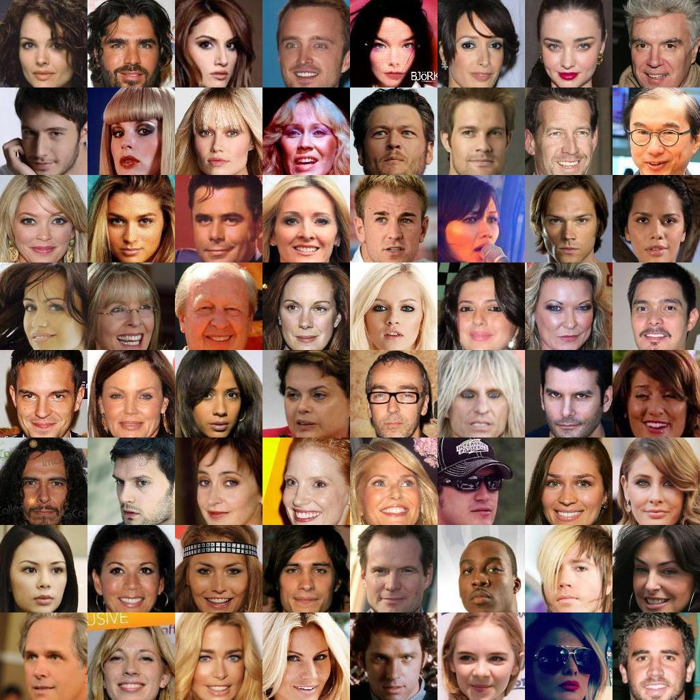

# Super resolution in Tensorflow

Super resolution of an image using Efficient subpixel Phase Shift CNNs.

* DCGAN
	* The final architecture is a modified version of the traditional DCGAN, with 3 1x1 convolutional layers (leaky ReLU activation) followed by a phase shift deconvolution with ratio 2, followed by 2 1x1 convolutional layers, another phase shift deconvolution with ratio 2, and finally 2 more 1x1 convolutional layers. The final output is passed through a tanh to force it in the [0,1] range.
	* Multiple architectures and their checkpoints have been tried in the past, including the vanilla DCGAN architecture, vanilla architecture with an extra 1x1 convolutional layer post the phase shift, extra up-sampling followed by maxpooling, etc. To obtain their checkpoints, kindly refer to older commits
	* Since the training is performed on 32 x 32 images, to perform super resolution on an image of different dimensions, the image is broken down into a grid with cells of dimension 32x32 (zero padding done on dimensions to make them a multiple of 32)
* VAE
	Work in progress
* SegNet
	Work in progress

## Results

**Training**
<table >
	<tbody>
		<tr>
			<td>Input</td>
			<td>Output</td>
			<td>Ground Truth</td>
		</tr>
		<tr>
			<td></td>
			<td></td>
			<td></td>
		</tr>
	</tbody>
</table>

**Testing**
<table >
	<tbody>
		<tr>
			<td>Input</td>
			<td>Output</td>
		</tr>
		<tr>
			<td></td>
			<td></td>
		</tr>
	</tbody>
</table>


## Requirements
* Tensorflow 1.0+
* Python 3.5+
* Scipy, Numpy

## Execution
1. Training: (assuming the `celebA` dataset (split into `train`, `test` and `valid`) are located in the folder `data` in the repository folder)
    ```bash
    python main.py --dataset celebA --is_train True --is_crop True
    ```
2. Testing (suppose you want to test on `abc.png`)
    ```bash
    python main.py --test_image abc.png
    ```

## References

1.  [Real-Time Single Image and Video Super-Resolution Using an Efficient Sub-Pixel Convolutional Neural Network](https://arxiv.org/abs/1609.05158). By Shi et. al.  
2. [DCGAN](https://github.com/carpedm20/DCGAN-tensorflow)
3. [Phase Shift implementation](https://github.com/Tetrachrome/subpixel)
4. [Visualizing and Understanding Convolutional Networks](https://arxiv.org/abs/1311.2901). By Zeiler and Fergus.  
5. [A guide to convolution arithmetic for deep learning](https://arxiv.org/abs/1603.07285). By Dumoulin and Visin.

## Further reading
Alex J. Champandard made a really interesting analysis of this topic in this [thread](https://twitter.com/alexjc/status/782499923753304064).   
For discussions about differences between phase shift and straight up `resize` please see the companion [notebook](https://github.com/Tetrachrome/subpixel/blob/master/ponynet.ipynb) and this [thread](https://twitter.com/soumithchintala/status/782603117300965378).
